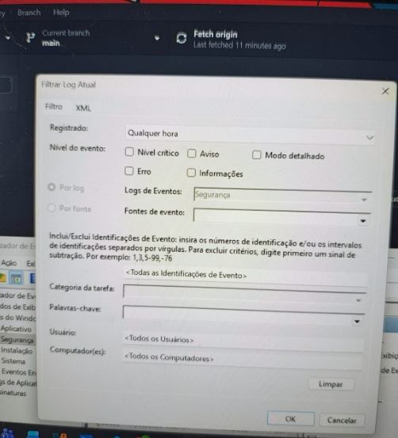
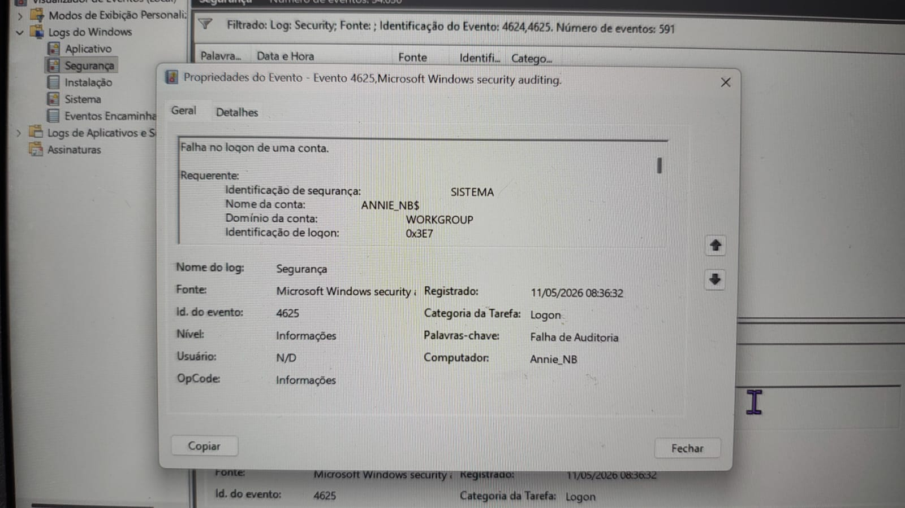
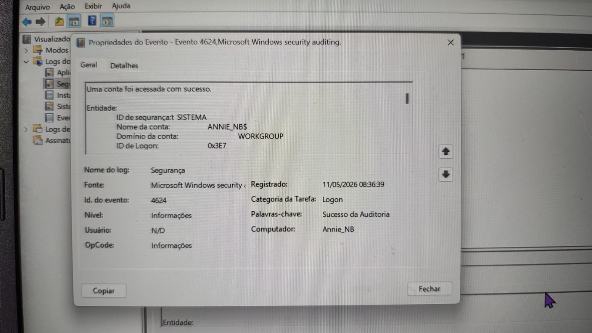
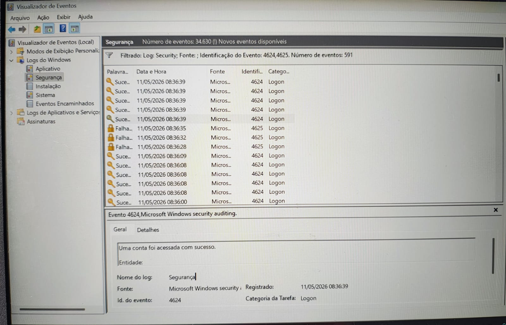

# Projeto — SOC / Blue Team Lab

## Objetivo

Este projeto tem como objetivo simular atividades básicas de monitoramento e investigação realizadas por um analista SOC (Security Operations Center), utilizando logs do Windows Event Viewer para identificar eventos de autenticação.

Foram analisados eventos de:

- login bem-sucedido
- falha de login
- auditoria de segurança
- monitoramento de autenticação

## Habilidades praticadas

- Monitoramento de logs
- Investigação de eventos
- Windows Event Viewer
- Análise de autenticação
- Threat Hunting básico
- SOC Operations

---

## Ferramentas utilizadas

- Windows Event Viewer
- Logs de Segurança do Windows
- Windows 10
- GitHub
- Visual Studio Code
- MITRE ATT&CK Framework

---

## Cenário simulado

Foi realizado um cenário controlado de autenticação no Windows contendo:
- múltiplas tentativas de login incorretas
- autenticação válida posterior
- geração de eventos de auditoria

Os eventos foram coletados e analisados através do Event Viewer.

---

## Eventos analisados

| Event ID | Descrição |
|---|---|
| 4624 | Login bem-sucedido |
| 4625 | Falha de login |

---

## Evidências coletadas

### Event Viewer

---

### Evento 4625 — Falha de login

---

### Evento 4624 — Login bem-sucedido

---

### Event Viewer filtrado

---

## Análise técnica

A investigação identificou múltiplos eventos de autenticação registrados no log de Segurança do Windows.

Os eventos 4625 indicaram tentativas de autenticação inválidas, compatíveis com falha de credenciais ou tentativa de acesso incorreto.

Após as falhas, foi identificado o evento 4624, indicando autenticação bem-sucedida no sistema.

Esse tipo de monitoramento é amplamente utilizado em ambientes SOC para:
- detecção de brute force
- monitoramento de autenticação
- investigação de acessos suspeitos
- auditoria de segurança
- identificação de comportamento anômalo

---

## MITRE ATT&CK

Táticas relacionadas:
- Credential Access
- Initial Access

Técnicas relacionadas:
- T1110 — Brute Force

---

## Conclusão

A análise demonstrou como eventos de autenticação do Windows podem ser utilizados para investigação defensiva e monitoramento de segurança.

O laboratório permitiu identificar falhas de login, autenticações válidas e eventos relevantes para atividades de SOC e Blue Team.

---

## Observação

Projeto desenvolvido para fins educacionais e prática em Segurança da Informação.